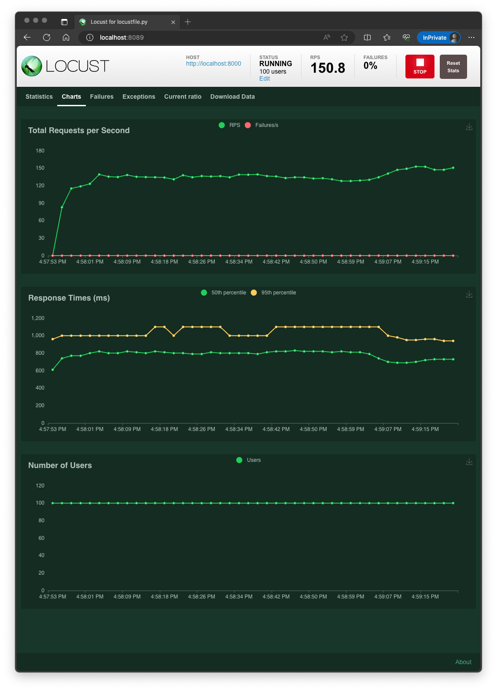

dynamic-batcher
===============

`dynamic_batcher` is designed for inferencing DL models using GPU and enforces model's concurrency.

### Installation

```bash
pip install dynamic_batcher
```

## Quickstart

### Additional Requirements

```bash
pip install -r requirements-test.txt
```

### Run

* redis
  RUN:
    ```bash
    docker run --rm -p 6379:6379 -e ALLOW_EMPTY_PASSWORD=yes bitnami/redis:latest
    ```

* [app](e2e/app/)  
  ENV:
    ```envfile
    REDIS__HOST=localhost
    REDIS__PORT=6379
    ```
  RUN:
    ```bash
    gunicorn e2e.app.main:app \
      -k=uvicorn.workers.UvicornWorker \
      --workers=4
    ```

* [batcher](e2e/batcher/)  
  ENV:
    ```envfile
    REDIS__HOST=localhost
    REDIS__PORT=6379

    DYNAMIC_BATCHER__BATCH_SIZE=64
    DYNAMIC_BATCHER__BATCH_TIME=2
    ```
  RUN:
    ```bash
    python e2e/batcher/run.py
    ```

* [locust](e2e/locust/)  
  RUN:
    ```bash
    locust -f e2e/locust/locustfile.py
    ```

### Test

* swagger: http://localhost:8000
  * POST `/items/test/{item_id}
    ```bash
    curl -X POST http://localhost:8000/items/test/1 \
      -H 'Content-Type: application/json' \
      -d '{
        "content": "string",
        "nested": {
          "key": "string",
          "values": [
            1,
            5,
            2
          ]
        }
      }'
    ```
    ```console
    {
      "data": {
        "content": "string",
        "nested": {
          "key": "string",
          "values": [
            1,
            5,
            2
          ],
          "values_add1": [
            2,
            6,
            3
          ]
        },
        "name": "b0878740-47a8-4dd7-bfe8-9c5ed1fee4ea"
      },
      "elapsed_time": 2.551218032836914
    }
    ```
* locust: http://localhost:8089
  
  


### Explanation

when `DYNAMIC_BATCHER__BATCH_SIZE=64` and `DYNAMIC_BATCHER__BATCH_TIME=2` is set,  
a running `BatchProcessor` waits to run a batch until the amount of requests received is met(`requests count=64`), for the batch_time(`2 seconds`). If the time is up, the partial amount of requests will be processed.

* Launch

```log
start test daemon
BatchProcessor start: delay=0.001, batch_size=64 batch_time=2
```

* Single request(concurrency=1)

```log
batch start: 2.001/2, 1/64
batch start: 2,001/2, 1/64
...
```

* Concurrent requests(concurrency=100)

```log
batch start: 1.653/2, 64/64
batch start: 0.064/2, 64/64
batch start: 0.064/2, 64/64
batch start: 0.064/2, 64/64
batch start: 0.064/2, 64/64
batch start: 0.064/2, 64/64
batch start: 0.064/2, 64/64
batch start: 0.064/2, 64/64
batch start: 0.064/2, 64/64
batch start: 0.064/2, 64/64
batch start: 0.064/2, 64/64
batch start: 0.064/2, 64/64
...
batch start: 2.001/2, 36/64
```


# Concept

ref: 
* https://github.com/triton-inference-server/tutorials/tree/main/Conceptual_Guide/Part_2-improving_resource_utilization#what-is-dynamic-batching


