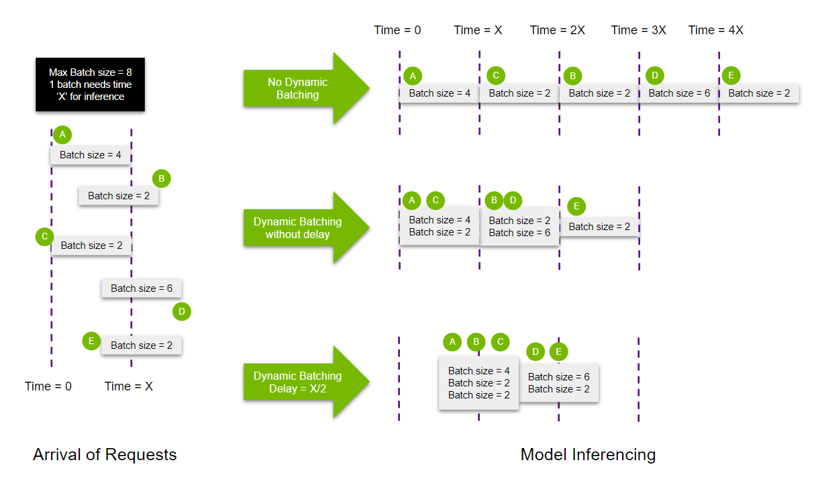

dynamic-batcher
===============

|Travis|_  |AppVeyor|_  |Coveralls|_  |Readthedocs|_   
|PyPi|_  |Python39|_  |Python310|_ 

.. |Travis| image:: https://travis-ci.org/pydemia/unipy.svg?branch=master
.. _Travis: https://travis-ci.org/pydemia/unipy

.. |AppVeyor| image:: https://ci.appveyor.com/api/projects/status/github/pydemia/unipy?branch=master&svg=true
.. _AppVeyor: https://ci.appveyor.com/project/pydemia/unipy/history

.. |Coveralls| image:: https://coveralls.io/repos/github/pydemia/unipy/badge.svg?branch=master&service=github
.. _Coveralls: https://coveralls.io/github/pydemia/unipy

.. |Readthedocs| image:: https://readthedocs.org/projects/unipy/badge/?version=latest
.. _Readthedocs: http://unipy.readthedocs.io/en/latest/?badge=latest

.. |PyPi| image:: https://badge.fury.io/py/unipy.svg
.. _PyPi: https://badge.fury.io/py/unipy.svg

.. |Python39| image:: https://img.shields.io/badge/python-3.9-blue.svg 
.. _Python39: https://badge.fury.io/py/unipy.svg 

.. |Python310| image:: https://img.shields.io/badge/python-3.10-blue.svg 
.. _Python310: https://badge.fury.io/py/unipy.svg 

Intro
=====

`dynamic_batcher` is designed for inferencing DL models using GPU and enforces model's concurrency.

Installation
------------

.. code-block:: bash

  pip install dynamic-batcher

Quickstart
----------

Additional Requirements
^^^^^^^^^^^^^^^^^^^^^^^

.. code-block:: bash

  pip install -r requirements-test.txt

Run
^^^

* redis  
    - RUN:
  
      .. code-block:: bash

         docker run --rm -p 6379:6379 -e ALLOW_EMPTY_PASSWORD=yes bitnami/redis:latest

* `app <e2e/app/>`_
    - ENV:

      .. code-block::
      
        REDIS__HOST=localhost
        REDIS__PORT=6379

    - RUN:

      .. code-block:: bash

        gunicorn e2e.app.main:app \
           -k=uvicorn.workers.UvicornWorker \
           --workers=4

* `batcher <e2e/batcher/>`_
    - ENV:

      .. code-block::

        REDIS__HOST=localhost
        REDIS__PORT=6379

        DYNAMIC_BATCHER__BATCH_SIZE=64
        DYNAMIC_BATCHER__BATCH_TIME=2

    - RUN:

      .. code-block:: bash

        python e2e/batcher/run.py

* `locust <e2e/locust/>`_
    - RUN:

      .. code-block:: bash

        locust -f e2e/locust/locustfile.py

Test
^^^^

* swagger: http://localhost:8000
    - POST ``/items/test/{item_id}``

        .. code-block:: bash

          curl -X POST http://localhost:8000/items/test/1 \
          -H 'Content-Type: application/json' \
          -d '{
            "content": "string",
            "nested": {
              "key": "string",
              "values": [
                1,
                5,
                2
              ]
            }
          }'

    - result:

        .. code-block:: console

          {
            "data": {
              "content": "string",
              "nested": {
                "key": "string",
                "values": [
                  1,
                  5,
                  2
                ],
                "values_add1": [
                  2,
                  6,
                  3
                ]
              },
              "name": "b0878740-47a8-4dd7-bfe8-9c5ed1fee4ea"
            },
            "elapsed_time": 2.551218032836914
          }

* locust: http://localhost:8089

  .. image:: img/locust-start.png
     :target: img/locust-start.png
     :alt: locust-start

  .. image:: img/locust-run.png
     :target: img/locust-run.png
     :alt: locust-run

Explanation
^^^^^^^^^^^

when ``DYNAMIC_BATCHER__BATCH_SIZE=64`` and ``DYNAMIC_BATCHER__BATCH_TIME=2`` is set,

a running ``BatchProcessor`` waits to run a batch until the amount of requests received is met(\ ``requests count=64``\ ), for the batch_time(\ ``2 seconds``\ ). If the time is up, the partial amount of requests will be processed.

* Startup log

  .. code-block::
  
     start test daemon
     BatchProcessor start: delay=0.001, batch_size=64 batch_time=2

* Single request(concurrency=1)

  .. code-block::
  
     batch start: 2.001/2, 1/64
     batch start: 2,001/2, 1/64
     ...

* Concurrent requests(concurrency=100)

  .. code-block::
  
     batch start: 1.653/2, 64/64
     batch start: 0.064/2, 64/64
     batch start: 0.064/2, 64/64
     batch start: 0.064/2, 64/64
     batch start: 0.064/2, 64/64
     batch start: 0.064/2, 64/64
     batch start: 0.064/2, 64/64
     batch start: 0.064/2, 64/64
     batch start: 0.064/2, 64/64
     batch start: 0.064/2, 64/64
     batch start: 0.064/2, 64/64
     batch start: 0.064/2, 64/64
     ...
     batch start: 2.001/2, 36/64

Concept
=======

Ref.: `NVIDIA Triton's dynamic batching <https://github.com/triton-inference-server/tutorials/tree/main/Conceptual_Guide/Part_2-improving_resource_utilization#what-is-dynamic-batching>`_

